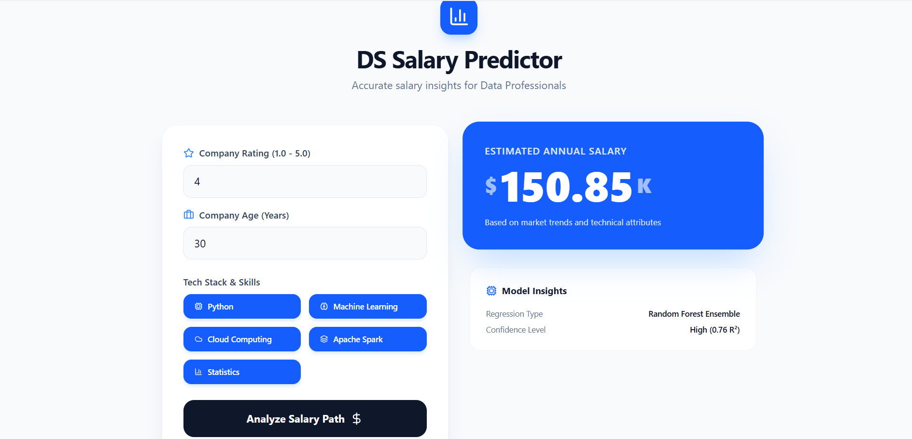

---

# DS Salary Prediction Project

**End-to-End Data Science Project**: Web scraping, data cleaning, exploratory data analysis, machine learning modeling, and Flask API deployment for predicting Data Scientist salaries in India.

---

---

## Project Overview

This project predicts **data scientist salaries in India** by:

1. Scraping job postings from Glassdoor.
2. Cleaning and preprocessing the data.
3. Performing EDA and feature engineering.
4. Training regression and ensemble models.
5. Deploying the best model via a Flask API for real-time predictions.

---

## Professional Dashboard

The project now features a modern, interactive React-based dashboard for real-time salary predictions.



---

## Folder Structure

```
folder/
│
├── building.py               # ML model building script
├── chromedriver.exe          # ChromeDriver for Selenium
├── data_cleaning.py          # Data cleaning and preprocessing
├── eda.ipynb                 # Exploratory Data Analysis & feature engineering
├── eda_data.csv              # EDA dataset
├── glassdoor_jobs.csv        # Scraped raw job data
├── glassdoor_scraper.py      # Glassdoor scraping script
├── glassdoor_scraper1.py     # Alternative Glassdoor scraper
├── LICENSE
├── README.md
├── requirements.txt
├── salary_data_cleaned.csv   # Cleaned dataset
├── test1.spydata
├── FlaskAPI/
│   ├── app.py                # Flask API for model predictions
│   ├── data_input.py         # Sample input for API
│   ├── sarthak.py            # Script to call API
│   └── wsgi.py               # WSGI entrypoint
└── .gitignore
```

---

## Installation

1. Clone the repository:

```bash
git clone https://github.com/EasySarthak1440/ds_salary_prediction.git
cd ds_salary_prediction/folder
```

2. Create a Python virtual environment:

```bash
python -m venv glass_env
```

3. Activate the environment:

* Windows:

```bash
glass_env\Scripts\activate
```

* Mac/Linux:

```bash
source glass_env/bin/activate
```

4. Install dependencies:

```bash
pip install -r requirements.txt
```

5. Download **ChromeDriver** matching your Chrome version and place it in this folder:
   [ChromeDriver Download](https://chromedriver.chromium.org/downloads)

---

## Usage

### 1. Web Scraping

`glassdoor_scraper.py` scrapes jobs from Glassdoor:

```python
from glassdoor_scraper import get_jobs

path = "chromedriver.exe"
df = get_jobs('data scientist', 10, verbose=True, path=path, sleep_time=15)
df.to_csv('glassdoor_jobs.csv', index=False)
```

* Collects job title, salary, company info, skills, location, etc.

---

### 2. Data Cleaning

`data_cleaning.py` processes the raw data:

```python
import pandas as pd

df = pd.read_csv('glassdoor_jobs.csv')
# Cleans salary, company names, skills, computes company age, and flags features
# Saves cleaned data as salary_data_cleaned.csv
```

---

### 3. EDA & Modeling

`eda.ipynb`:

* Performs EDA and feature engineering.
* Trains Linear Regression, Lasso, and Random Forest models.
* Performs hyperparameter tuning with GridSearchCV.
* Evaluates models using Mean Absolute Error (MAE).
* Saves the best model as `model_file.joblib`.

---

### 4. Flask API Deployment

`FlaskAPI/app.py`:

* Provides `/predict` POST endpoint.
* Accepts JSON input (list of numerical features).
* Returns salary prediction.

```bash
python FlaskAPI/app.py
```


---

## Technologies & Libraries

* **Python 3.11+**
* **Libraries:** pandas, numpy, matplotlib, scikit-learn, statsmodels, selenium, flask, joblib, requests
* **Webdriver:** ChromeDriver
* **ML Models:** Linear Regression, Lasso, Random Forest, Ensemble

---

## Contributing

1. Fork the repository.
2. Create a branch: `git checkout -b feature-name`
3. Commit changes: `git commit -m "Description"`
4. Push: `git push origin feature-name`
5. Open a Pull Request.

---

## License

This project is licensed under the **MIT License** — see [LICENSE](LICENSE) for details.

---


